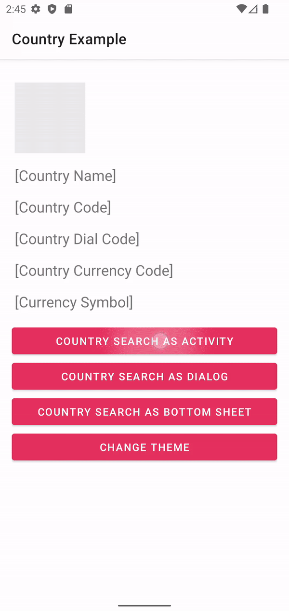
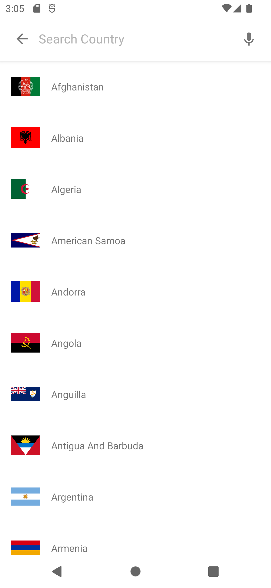
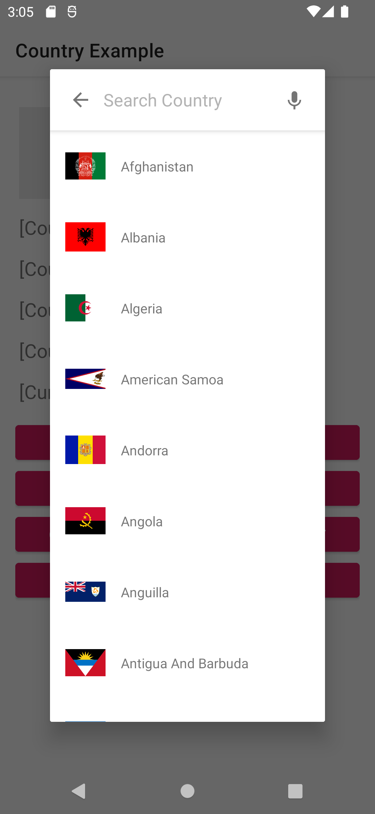
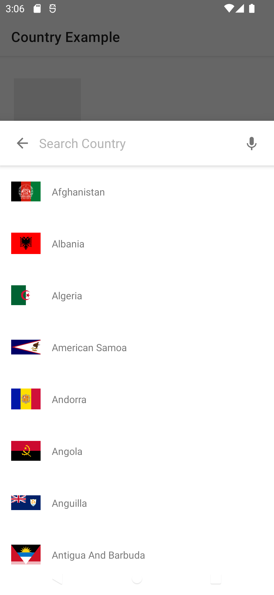
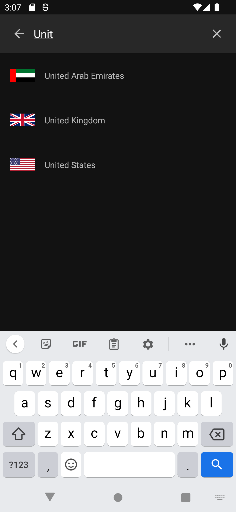

Country Selection Library
===========================
[](https://jitpack.io/#naveenkumarn27/country)
[](https://android-arsenal.com/api?level=21)


Country selection library. Can launch this selection picker as an activity, fragment, dialog or bottom sheet to show the list of country with flag. Please follow the below implementation to access the flag selection picker.



<br>

|                   Activity                    |                   Dialog                    |                   Bottom Sheet                    |                   Dark Theme                    |
|:---------------------------------------------:|:-------------------------------------------:|:-------------------------------------------------:|:-----------------------------------------------:|
|  |  |  |  |

How to add to your project
--------------

Sample implementation gif for country selection and using search functionality 

Add repository info in your root project gradle file

```gradle
// project.gradle
allprojects {
	repositories {
		...
		maven { url 'https://jitpack.io' }
	}
}
```

Add this below in your app.gradle

```gradle
// app.gradle
dependencies {
    implementation "com.github.nkuppan:country:${latestVersion}"
}
```

## Implementation

Simple steps to achieve. Call country search activity with result.

Starting country selection as activity based

Calling as an activity:
--------------
```kotlin

//Registering result receiver as a global variable or registering before Lifecycle.Event.CREATED

private val countrySelectionReceiver = registerForActivityResult(
	ActivityResultContracts.StartActivityForResult()
) { result ->
	if (result.resultCode == Activity.RESULT_OK) {
		val country: Country? =
                	result.data?.getParcelableExtra(RequestParam.SELECTED_VALUE)

            	if (country != null) {
                	changeValues(country)
            	}
        }
}

override fun onCreate(savedInstanceState: Bundle?) {
	super.onCreate(savedInstanceState)

        setContentView(R.layout.main_activity)

        findViewById<Button>(R.id.select_flag).setOnClickListener {
            countrySelectionReceiver.launch(
                Intent(this@MainActivity, CountrySearchActivity::class.java)
            )
        }
}
```

Calling as an activity with result (Legacy way):
--------------
```kotlin
startActivityForResult( Intent(context, CountrySearchActivity::class.java), RequestCode.COUNTRY_SEARCH_CODE)
```

You will receive your result once the user is selected the country

```kotlin
override fun onActivityResult(requestCode: Int, resultCode: Int, data: Intent?) {
    super.onActivityResult(requestCode, resultCode, data)

    if (resultCode == Activity.RESULT_OK && requestCode == RequestCode.COUNTRY_SEARCH_CODE) {
        data?.apply {
            val country: Country? = getParcelableExtra(RequestParam.SELECTED_VALUE)
            if (country != null) {
                Snackbar.make(
                        button,
                        "Selected Country [ name, code ] [${country.countryName} , ${country.countryCode}]",
                        Snackbar.LENGTH_SHORT
                ).show()
            }
        }
    }
}
```

Calling as a dialog:
--------------
```kotlin
val ft = supportFragmentManager.beginTransaction()
val countryListDialogFragment = CountryListDialogFragment()
countryListDialogFragment.countrySelection = {
    changeValues(it)
    countryListDialogFragment.dismiss()
}
countryListDialogFragment.show(ft, "dialog")
```

Calling as a bottom sheet:
--------------
```kotlin
val ft = supportFragmentManager.beginTransaction()
val countryListBottomSheet = CountryListBottomSheet()
countryListBottomSheet.countrySelection = {
    changeValues(it)
    countryListBottomSheet.dismiss()
}
countryListBottomSheet.show(ft, "bottom_sheet_dialog")
```

Customize with your own UI:
--------------
Can read the available countries by using below link and show them in the UI.

```kotlin
coroutineScope.launch {
	val countryList = readCountryList(getApplication())
}

//To read flag image drawable
countryModel.getCountryImage(context)
```

## License

[Apache Version 2.0](http://www.apache.org/licenses/LICENSE-2.0.html)

    Copyright (C) 2019 Naveen Kumar Kuppan

    Licensed under the Apache License, Version 2.0 (the "License");
    you may not use this file except in compliance with the License.
    You may obtain a copy of the License at

       http://www.apache.org/licenses/LICENSE-2.0

    Unless required by applicable law or agreed to in writing, software
    distributed under the License is distributed on an "AS IS" BASIS,
    WITHOUT WARRANTIES OR CONDITIONS OF ANY KIND, either express or implied.
    See the License for the specific language governing permissions and
    limitations under the License.
