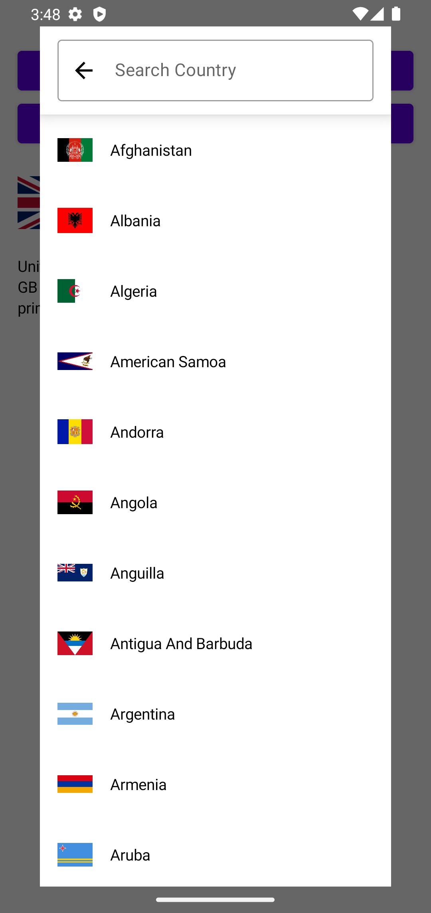
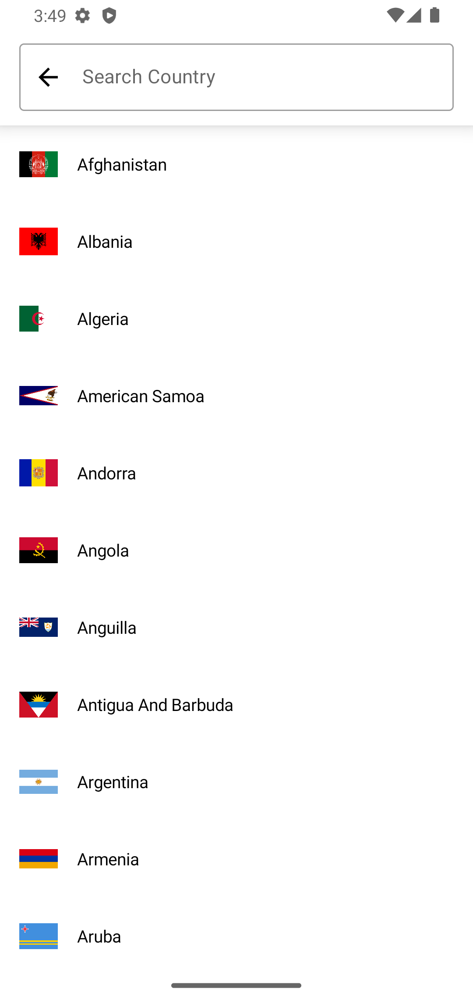

Country Selection Library
===========================
[](https://jitpack.io/#naveenkumarn27/country)
[](https://android-arsenal.com/api?level=21)


Country selection library. Can launch this selection picker as an activity, fragment, dialog or bottom sheet to show the list of country with flag. Please follow the below implementation to access the flag selection picker.


|                             XML Sample                             |                             Compose Sample                             |
|:------------------------------------------------------------------:|:----------------------------------------------------------------------:|
|    |    |

<br>

|                     XML Activity                      |                      XML Dialog                       |                   XML Bottom Sheet                    |
|:-----------------------------------------------------:|:-----------------------------------------------------:|:-----------------------------------------------------:|
|      |       |  |
|    :---------------------------------------------:    | :---------------------------------------------------: |  :-------------------------------------------------:  |
|                   Compose New Page                    |                    Compose Dialog                     |                      Dark Theme                       |
|    :---------------------------------------------:    | :---------------------------------------------------: |  :-------------------------------------------------:  |
|  |    |        | 

How to add to your project
--------------

Sample implementation gif for country selection and using search functionality 

Add repository info in your root project gradle file

```gradle
// project.gradle
allprojects {
	repositories {
		...
		maven { url 'https://jitpack.io' }
	}
}
```

Add this below in your app.gradle

```gradle
// app.gradle

android {
    
    compileOptions {
        sourceCompatibility JavaVersion.VERSION_1_8
        targetCompatibility JavaVersion.VERSION_1_8
    }
    
    kotlinOptions {
        jvmTarget = JavaVersion.VERSION_1_8.toString()
    }
}

dependencies {
    implementation("com.github.nkuppan.country:country:${latestVersion}")
    implementation("com.github.nkuppan.country:countrycompose:${latestVersion}")
}
```

## Implementation

Simple steps to achieve. Call country search activity with result.

Starting country selection as activity based

Calling as an activity:
--------------

```kotlin

//Registering result receiver as a global variable or registering before Lifecycle.Event.CREATED
import com.github.nkuppan.country.utils.getCountryImage
import com.github.nkuppan.country.utils.launchCountrySelectionActivity

private val countrySelectionReceiver = registerForActivityResult(
    ActivityResultContracts.StartActivityForResult()
) { result ->
    if (result.resultCode == Activity.RESULT_OK) {

        val country: Country = result.getSelectedCountryData()

        if (country != null) {
            changeValues(country)
        }
    }
}

override fun onCreate(savedInstanceState: Bundle?) {
    super.onCreate(savedInstanceState)

    setContentView(R.layout.main_activity)

    binding.searchActivity.setOnClickListener {
        countrySelectionReceiver.launchCountrySelectionActivity(this)
    }
}
```

Calling as an activity with result (Legacy way):
--------------
```kotlin
activity.launchCountrySelectionActivity()
```

You will receive your result once the user is selected the country

```kotlin
import com.github.nkuppan.country.utils.getSelectedCountryData
import com.github.nkuppan.country.utils.isCountrySelectionResult

override fun onActivityResult(requestCode: Int, resultCode: Int, data: Intent?) {
    super.onActivityResult(requestCode, resultCode, data)
    if (isCountrySelectionResult(requestCode, resultCode)) {
        val country: Country? = data?.getSelectedCountryData()

        if (country != null) {
            changeValues(country)
        }
    }
}
```

Calling as a dialog:
--------------
```kotlin
import com.github.nkuppan.country.utils.openCountrySelectionDialog

supportFragmentManager.openCountrySelectionDialog {
    changeValues(it)
}
```

Calling as a bottom sheet:
--------------
```kotlin
import com.github.nkuppan.country.utils.openCountrySelectionBottomSheet

supportFragmentManager.openCountrySelectionBottomSheet {
    changeValues(it)
}
```

## License

[Apache Version 2.0](http://www.apache.org/licenses/LICENSE-2.0.html)

    Copyright (C) 2019 Naveen Kumar Kuppan

    Licensed under the Apache License, Version 2.0 (the "License");
    you may not use this file except in compliance with the License.
    You may obtain a copy of the License at

       http://www.apache.org/licenses/LICENSE-2.0

    Unless required by applicable law or agreed to in writing, software
    distributed under the License is distributed on an "AS IS" BASIS,
    WITHOUT WARRANTIES OR CONDITIONS OF ANY KIND, either express or implied.
    See the License for the specific language governing permissions and
    limitations under the License.
